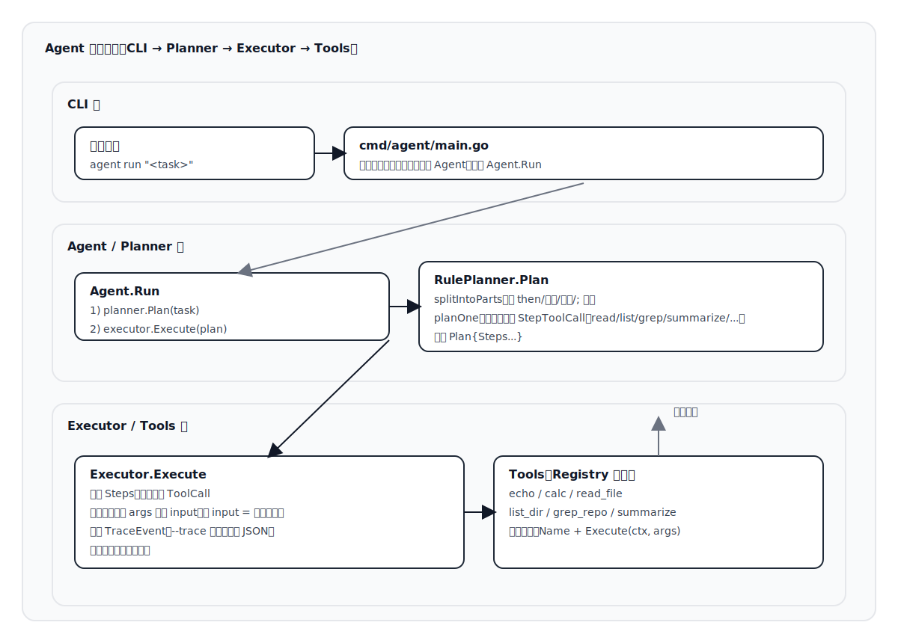

# Agent（Go）

这是一个从零开始、可逐步迭代的工具调用型 Agent 项目。

## 快速开始

```bash
go test ./...
go run ./cmd/agent run "calc: (1+2)*3"
go run ./cmd/agent run --trace "echo: 你好"
```

## 示例：受控读取文件

```bash
go run ./cmd/agent run --trace "read: README.md first 20 lines and summarize"
```

默认只允许读取 `--root` 指定目录下的文件（默认为当前工作目录），并限制单次读取最大字节数。

## 示例：多步任务执行（链式）

每一步会把上一步的输出，作为下一步的 `input`（如果下一步没显式给 `input`）。

```bash
go run ./cmd/agent run --trace "read: README.md first 10 lines then summarize"
```

```bash
go run ./cmd/agent run --trace "list: . then grep: \"package\" then summarize"
```

## 架构与调用链路（可视化）

下图为静态 SVG 图片，README 在任意 Markdown 渲染器中都会直接显示（不依赖 Mermaid 支持）。



<details>
<summary>（可选）查看 Mermaid 源码</summary>

```mermaid
flowchart TD
  A[用户: agent run "<task>"] --> B[cmd/agent/main.go<br/>解析参数: --trace/--json/--root]
  B --> C[构建工具注册表 tools.Registry<br/>Register: echo/calc/read_file/list_dir/grep_repo/summarize]
  C --> D[创建 Planner: RulePlanner]
  D --> E[创建 Executor: Executor]
  E --> F[创建 Agent: agent.New(planner, executor)]
  F --> G[Agent.Run(ctx, task, traceWriter)]

  G --> H[Planner.Plan(task)<br/>rule_planner.go]
  H --> I[splitIntoParts<br/>按 then/然后/并且/; 拆分]
  I --> J[planOne(每段)<br/>映射成 StepToolCall]
  J --> K[Plan{Steps...}]

  K --> L[Executor.Execute(plan)<br/>executor.go]
  L --> M{遍历每个 Step}
  M -->|ToolCall| N[execTool: reg.Get(tool)]
  N --> O{args 是否包含 input?}
  O -->|否且 last!=nil| P[注入 args.input = FormatResult(last)]
  O -->|是| Q[保留原 args]
  P --> R[tool.Execute(ctx, args)]
  Q --> R
  R --> S[更新 last = result]
  R --> T[记录 TraceEvent<br/>--trace 时输出 JSON 行]
  T --> M

  M -->|Final| U[直接返回 step.Text]
  M -->|结束| V[返回 FormatResult(last)]
```
</details>
